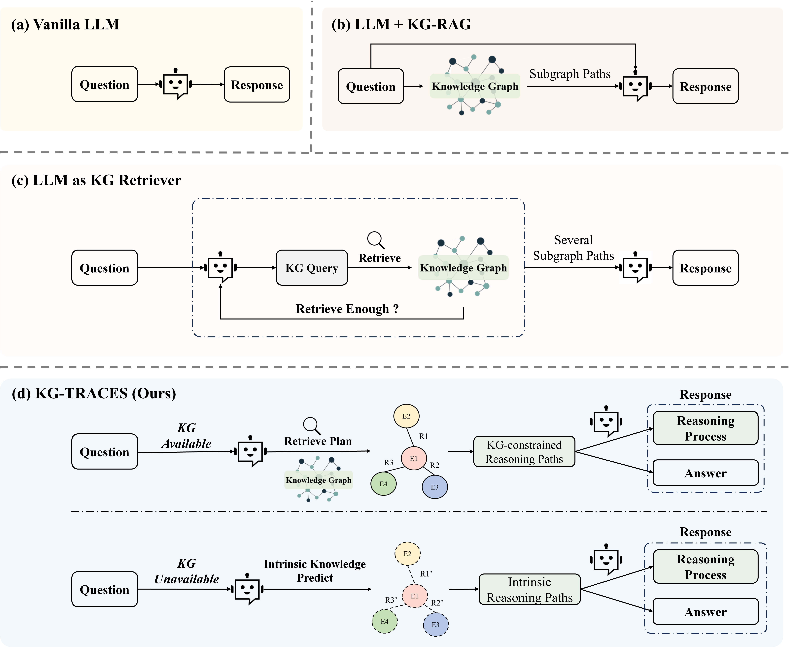
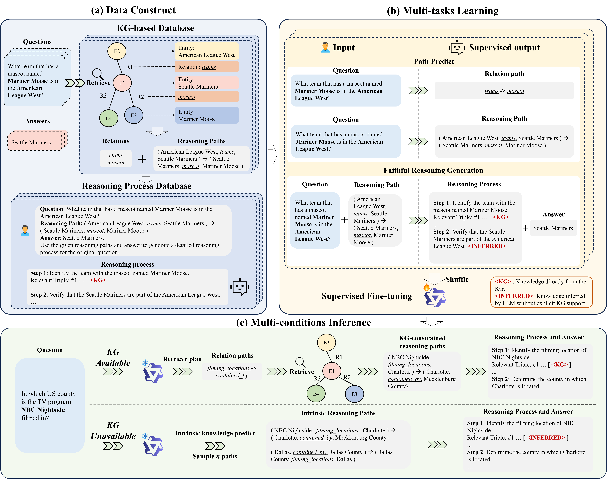

# KG-TRACES
This repository contains the code for the paper "KG-TRACES: Enhancing Large Language Models with Knowledge Graph-constrained Trajectory Reasoning and Attribution Supervision".

## Overview

xx




## Updates Log
- The paper is now available on [arXiv](https://arxiv.org/abs/2506.00783).


## Getting Started
```
pip install -r requirements.txt
```

## Dataset
The SFT augment WebQSP dataset and CWQ dataset are available at [KG-TRACES-WebQSP](https://huggingface.co/datasets/Edaizi/KG-TRACES-WebQSP) and [KG-TRACES-CWQ](https://huggingface.co/datasets/Edaizi/KG-TRACES-CWQ). 


